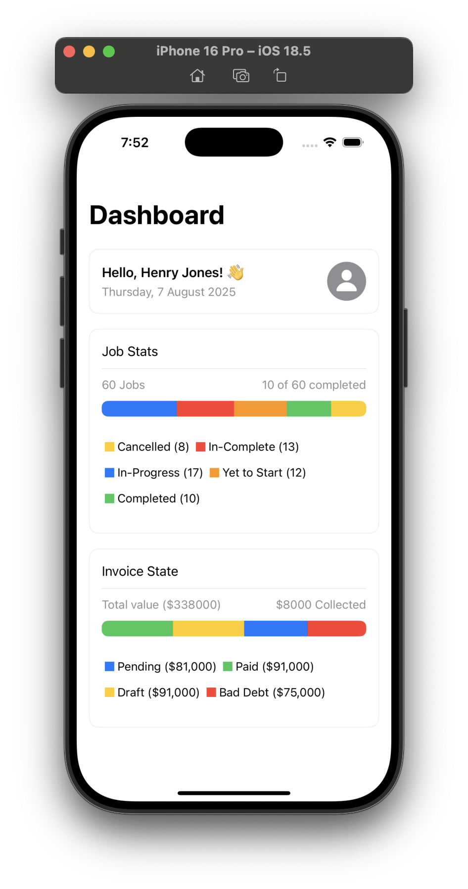
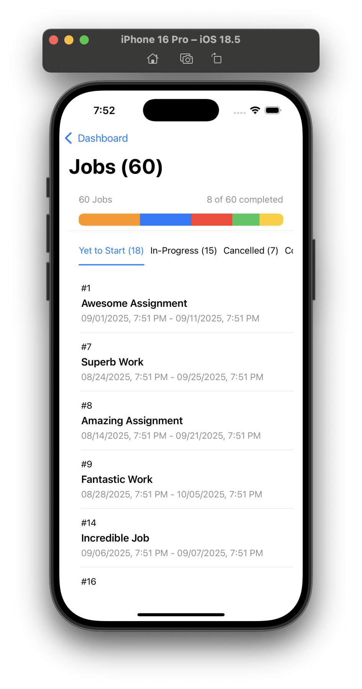

# 📊 SwiftUI-Chart-App

A chart-based SwiftUI dashboard built using **Clean MVVM**, **Combine**, and **native SwiftUI Navigation**, with **custom charts** rendered using `Path`, `Shape`, and `GeometryReader` — without using any external libraries.

---

## 🚀 Features

- ✅ SwiftUI-based dashboard UI  
- ✅ Clean MVVM architecture  
- ✅ Charts built using native SwiftUI (no libraries)  
- ✅ Reactive data flow using Combine  
- ✅ SwiftUI NavigationStack  
- ✅ 100% Swift — no external dependencies  

---

## 🧰 Tech Stack

- Swift 5.9+  
- SwiftUI (iOS 15+)  
- Combine  
- MVVM Architecture  

---

## 📸 Screenshots


## 📸 Screenshots


|  |  |


---

## 📦 Installation

1. Clone the repository:

   ```bash
   git clone https://github.com/Ajaykumar1d/SwiftUI-Chart-App.git
